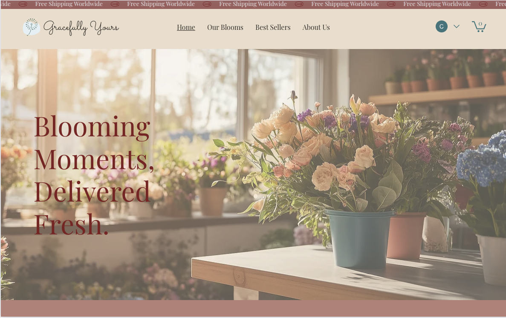

# Flower Shop Online Store Template

This project is a fully functional online store template built using **Wix Studio**. Designed for flower shops, it can also be adapted for similar businesses such as gift shops, boutique stores, or any business that offers products for online purchase. 

## Features

- **Online Store**: A dedicated section for displaying products and managing inventory.
- **Featured Products Section**: Highlight specific products to catch customers' attention.
- **Responsive Design**: Optimized for both desktop and mobile viewing.
- **User-Friendly Navigation**: A clean and intuitive layout that ensures easy navigation for customers.
- **Customizable Backgrounds**: Change colors, images, and other design elements effortlessly.
- **Free Shipping Banner**: Eye-catching banner to promote special offers like free shipping worldwide.

## Technologies Used

- **Wix Studio**: Used for designing and implementing the template.

## How to Use

1. Clone this repository to your local environment or use it directly on Wix Studio.
2. Customize the template as per your business needs:
   - Update the logo, product images, and text.
   - Configure the online store settings such as pricing and inventory.
3. Publish the site and connect a domain.

## Customization

This template is versatile and can be easily adapted for:
- Flower shops
- Gift stores
- Artisan boutiques
- Home décor stores
- Specialty product businesses

## Check out the live demo of this template here:
[Flower Shop Template Live Site](https://jjatwork.wixstudio.com/flowershop)

### License

This template is licensed for use only within the **Wix Studio platform**. Redistribution or use outside Wix Studio is not permitted.

## Contact

For inquiries or support, feel free to reach out to [jj-codes-9](mailto:contact@jjatwork.com).

---
